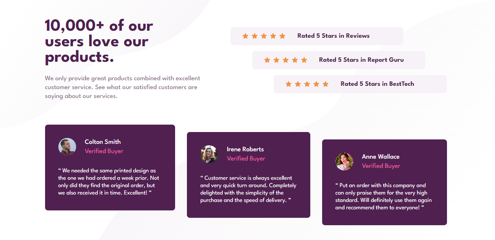

# Frontend Mentor - Social proof section solution

This is a solution to the [Social proof section challenge on Frontend Mentor](https://www.frontendmentor.io/challenges/social-proof-section-6e0qTv_bA). Frontend Mentor challenges help you improve your coding skills by building realistic projects. 

## Table of contents

- [Frontend Mentor - Social proof section solution](#frontend-mentor---social-proof-section-solution)
  - [Table of contents](#table-of-contents)
  - [Overview](#overview)
    - [The challenge](#the-challenge)
    - [Screenshot](#screenshot)
    - [Links](#links)
  - [My process](#my-process)
    - [Built with](#built-with)
    - [Continued development](#continued-development)
  - [Author](#author)

## Overview

### The challenge

Users should be able to:

- View the optimal layout for the section depending on their device's screen size

### Screenshot

### Links

- Solution URL: [GitHub](https://github.com/lemartinezm/social-proof-section)
- Live Site URL: [Vercel](https://social-proof-section-beryl-omega.vercel.app/)

## My process

### Built with

- Semantic HTML5 markup
- CSS custom properties
- Flexbox
- Mobile-first workflow
- SASS/SCSS

### Continued development

- Semantic HTML5 markup
- SASS/SCSS

## Author

- Frontend Mentor - [@lemartinezm](https://www.frontendmentor.io/profile/lemartinezm)
- LinkedIn - [lemartinezm](https://www.linkedin.com/in/lemartinezm)
- Twitter - [@Luis14151617](https://twitter.com/Luis14151617)
